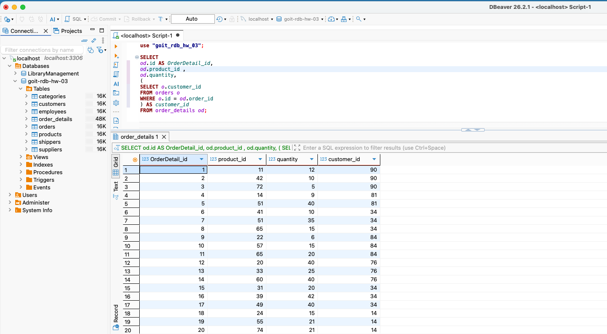
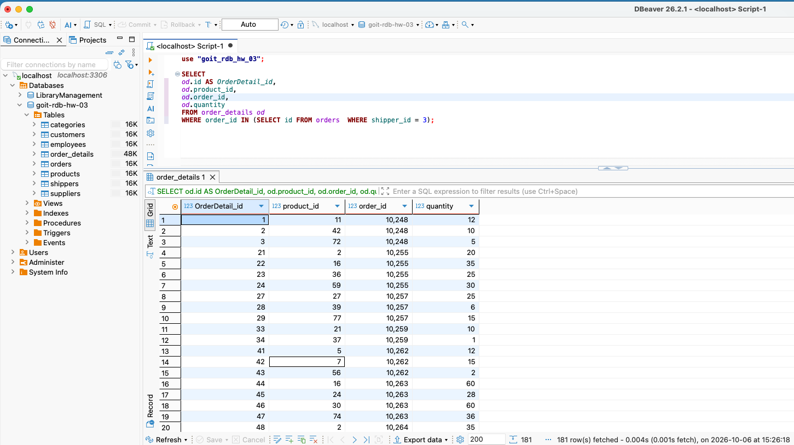
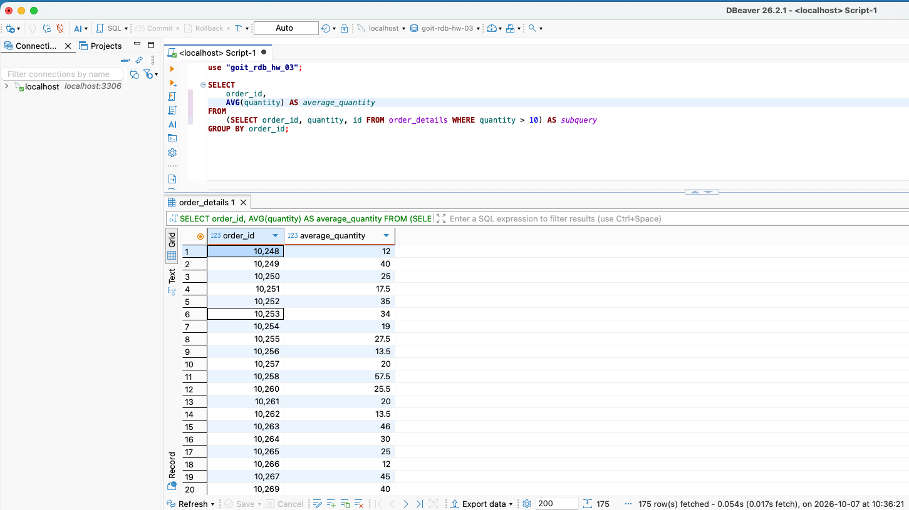
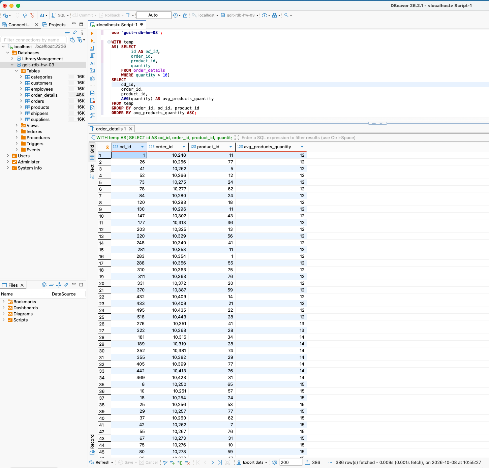
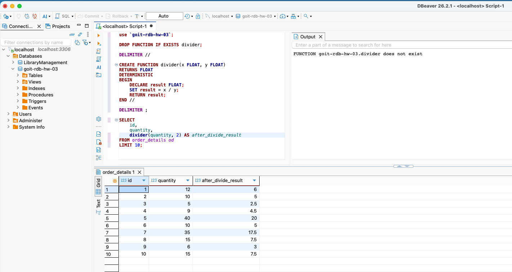

# SQL RDB Homework 05

## Tasks and Results

### Task 1: Subquery in SELECT
**Description:** Write an SQL query to display the order_details table with the customer_id field from the orders table for each record in order_details using a subquery in the SELECT clause.

**Screenshot of the result**

### Task 2: Subquery in WHERE
**Description:** Write an SQL query to display the order_details table filtered so that the corresponding record in the orders table meets the condition shipper_id=3, using a subquery in the WHERE clause.

**Screenshot of the result**

### Task 3: Subquery in FROM
**Description:** Write an SQL query embedded in the FROM clause to select rows with quantity>10 from the order_details table. For the obtained data, find the average value of the quantity field, grouped by order_id.

**Screenshot of the result**

### Task 4: Using WITH Clause
**Description:** Solve Task 3 using the WITH operator to create a temporary table temp.

**Screenshot of the result**

### Task 5: Divider Function
**Description:** Create a function with two parameters that divides the first parameter by the second. Both parameters and the return value should be of type FLOAT. Apply the function to the quantity attribute of the order_details table.

**Screenshot of the result**

